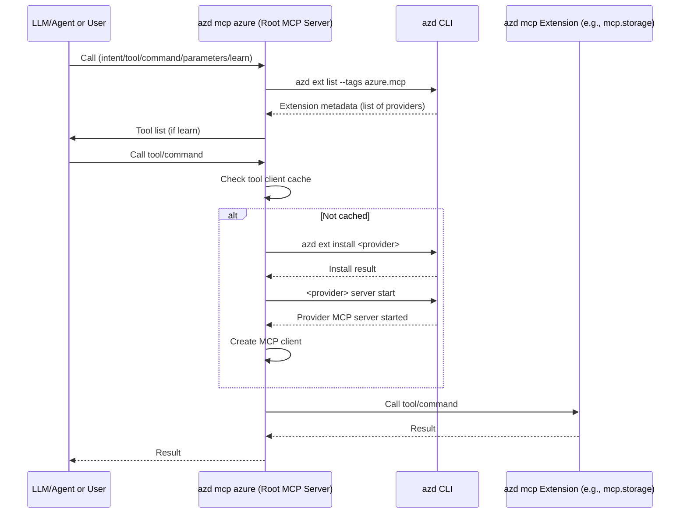

# Azure MCP via `azd` extensions

This repository demonstrates a modular, scalable approach to Azure automation and resource management using the Azure Developer CLI (`azd`) and the Model Context Protocol (MCP). The root `mcp.azure` extension provides a single, unified MCP server that dynamically discovers, installs, and delegates requests to provider-specific MCP extensions (such as storage, keyvault, resource, and azd). This architecture enables real-time, programmatic access to Azure resources and services, supports iterative learning and tool discovery for LLMs/agents, and allows teams to build, ship, and update extensions independently—without requiring changes to the root server. Extensions can be implemented in any language and are loaded on demand, ensuring a minimal, relevant tool surface for automation and AI scenarios.

## Extension Examples

- `mcp.azure` - Root extension that host the Azure MCP server with dynamic discovery
- `mcp.azd` - Extension MCP server for working with `azd` CLI
- `mcp.resource` - Extension MCP server for working with generic Azure resources
- `mcp.keyvault` - Extension MCP server for working with Azure KeyVault resources
- `mcp.storage` - Extension MCP server for working with Azure Storage Accounts

## Highlights

- Single server registration in VS Code
- Single tool "azure" in the server
- Root tool discovers capabilities via `azd` extensions.
- Extensions are dynamically installed and invoked by the root server
- Each `azd` extension such as "storage", "keyvault" etc hosts its own MCP server
- Root server acts as an MCP server and client and dynamically dispatches calls to the child servers
- Azure teams can build, ship and iterate without any releases or changes required to the root extension
- Extensions can be built in any language

## Azure Developer CLI (`azd`)

- Single binary executable
- ~30MB unzipped
- Supports Windows, MacOS & Linux in both AMD64 and ARM64
- Easily embedded in containers (ex. Azure Cloud Shell, vscode.dev/azure)
- Installable via popular package managers including Choco, Winget, Homebrew, cURL
  - `npx` support can easily be added.
- **Security & Authentication:** Uses Azure authentication (e.g., Azure CLI login, service principals, managed identities); extensions inherit this context.
- **Extensibility:** Supports both official and custom extensions, distributed via public or private sources.
- **Version Compatibility:** Extensions should target compatible versions of `azd`; the root server can check for version mismatches.

### Performance

No in-depth performance metrics at this time for the MCP scenario.

- Single `azure` tool, no tool overload to consume LLMs/agents
- `azd` MCP extensions are lazily loaded on demand, no startup overhead
- Only required extensions are loaded, minimizing memory and CPU usage
- Installing new extensions only takes a few seconds
- Extensions as small as 5MB each (7MB extracted)
- Root server can check for extension updates and automatically update clients
- The architecture scales well as more extensions are added, since unused extensions do not impact baseline performance
- The root server starts quickly; additional delay only occurs when a new extension is first used

### Deployment

MCP contributors can leverage the [`azd` Extension Framework](https://github.com/Azure/azure-dev/blob/main/cli/azd/docs/extension-framework.md) to build, package and publish extensions to an `azd` extension source.

- **CI/CD Integration:** MCP extensions can be built and published as part of a CI/CD pipeline; automated testing is recommended.
- **Update Strategy:** Both the root server and extensions can be updated independently; the root server can check for and prompt updates to extensions.
- **Multi-Platform Support:** Both `azd` and extensions support Windows, MacOS, and Linux; deployment artifacts should be built for all target platforms.

MCP extensions can be hosted on official `azd` extension source or can reside in a custom extension source hosted in a local file or publicly accessible HTTPS endpoint.

## Dynamic Discovery & the "Learn" Pattern

The root `mcp.azure` server uses a dynamic discovery mechanism to enumerate and expose all available Azure MCP extensions at runtime. When the server starts, or when an agent or user requests to "learn" about available tools, the server:

- Calls `azd ext list --tags azure,mcp` to discover all installed and available MCP extensions.
- Dynamically installs any missing extensions on demand.
- Starts the MCP server for each provider extension only when needed.
- Maintains a cache of running tool clients to avoid redundant startups.

### The "Learn" Pattern and Azure Tool Parameters

The "learn" pattern is a core feature for LLMs/agents and users to explore available capabilities. The single `azure` tool exposes a flexible set of parameters that enable dynamic discovery and invocation of all available Azure MCP extension capabilities:

- `intent` (string): The high-level operation or scenario the agent/user wants to perform (e.g., "deploy", "list", "delete").
- `tool` (string): The name of the provider extension or sub-tool to invoke (e.g., "storage", "keyvault", "resource", "azd").
- `command` (string): The specific command or operation to execute within the selected tool (e.g., "list-containers", "delete-blob").
- `parameters` (object): A dictionary of command-specific parameters (e.g., storage account name, container name, blob name, etc.).
- `learn` (boolean): If set to `true`, triggers the "learn" pattern, returning the list of available tools and their schemas. Can be used recursively to drill down into sub-tools and commands.

#### Intended Usage Cycle

1. **Discovery:** The agent or user can always call the same `azure` tool, using the `learn` parameter to discover available sub-tools and commands in real time. For example:
   - `learn: true` with no tool specified returns the top-level list of available tools (e.g., storage, keyvault, resource, azd, etc.).
   - `learn: true, tool: "storage"` returns the list of commands and parameters supported by the storage extension, using the same MCP tool schema.
2. **Selection:** The agent can reason about the available tools and commands, and select the appropriate `tool`, `command`, and `parameters` for the desired operation.
3. **Invocation:** The agent invokes the selected operation by calling the `azure` tool with the chosen parameters.
4. **Iteration:** At any point, the agent can re-invoke `learn` to further explore or adapt to new capabilities, supporting robust, iterative, and agent-friendly automation.

This response uses the **same MCP tool list schema** as the MCP protocol itself, ensuring:

- Consistency: The tool list and schema are always up-to-date and machine-readable.
- Iterative Exploration: Agents can call `learn` recursively, specifying a tool name to drill down into its supported commands and parameters.
- Self-Describing: The system is fully self-describing, enabling agents to reason about and select tools programmatically.

This approach maximizes discoverability, flexibility, and agentic reasoning, making it well-suited for LLM-driven automation and interactive scenarios.

### Sampling

Sampling is a powerful MCP feature that allows servers to request LLM completions through the client, enabling sophisticated agentic behaviors while maintaining security and privacy.

How sampling works:

1. Server sends a `sampling/createMessage` request to the client.
2. Client reviews the request and can modify it.
3. Client samples from an LLM.
4. Client reviews the completion.
5. Client returns the result to the server.

This human-in-the-loop design ensures users maintain control over what the LLM sees and generates. (Note: This feature is not yet supported in all MCP clients.)

Currently, sampling is not widely adopted across MCP implementations, but as support grows, the "learn" pattern and other agentic workflows may evolve to leverage sampling for even more powerful, secure, and interactive automation scenarios.

This approach makes the system highly discoverable and agent-friendly, supporting robust, real-time, and iterative automation scenarios.

## Architecture & Flow (Sequence Diagram)

The following sequence diagram illustrates the dynamic, on-demand nature of extension management and call dispatching:

## Design Tradeoffs: Dynamic Extensions vs. Monolithic Server

This project uses a **dynamic extension model**: the root `mcp.azure` server discovers, installs, and starts provider MCP extensions on demand. This is in contrast to a **monolithic model** where all MCP tools are coded, shipped, and loaded in the root server.

**Dynamic Extension Model (current):**

- Extensions are developed, shipped, and updated independently.
- New tools/extensions require no changes to the root server.
- Only required extensions are loaded, reducing resource usage and startup time.
- Enables teams to use any language or tech stack.
- Slightly higher first-use latency due to extra roundtrips: discovery, possible install, and server startup before the first tool/command call. Subsequent calls are fast due to caching.
- Keeps the tool surface minimal and relevant for LLMs/agents, reducing the risk of tool bloat, confusion, or delay during initial tool selection.

**Monolithic Model (all tools in root):**

- All tools are always available, with no install/start delay.
- Simpler architecture, but all tools must be coded in the root server's language.
- Any update or new tool requires a full root server release.
- Larger binary and higher resource usage.
- May expose a large number of tools at once, which could bloat/confuse/delay LLMs or agents during initial tool selection, especially as the number of tools grows.

This dynamic approach maximizes flexibility, scalability, and team autonomy, at the cost of slightly increased complexity and first-use latency, while also helping LLMs/agents focus on a relevant, manageable set of tools.

## Comparison: Dynamic Tool Notification vs. Single "Azure" Tool with Learning

[See the dynamic proxy approach branch on GitHub](https://github.com/wbreza/azd-azure-mcp/tree/proxy)

An alternative approach to the current architecture is to dynamically add tools to the MCP server at runtime and send a `tools/list_changed` notification to the LLM/agent. This notification informs the agent that new tools are available, allowing it to invoke them as needed.

**In practice, however, this approach did not work as intended:**

- Even though the `tools/list_changed` notification was sent, the agent did not leverage any new tools within its current task or reasoning cycle.
- The agent only became aware of and used the new tools after the current request completed and a new, similar request was made.
- This led to a less fluid and less agentic experience, as the agent could not immediately take advantage of new capabilities in the middle of a workflow.

**In contrast, the single `azure` tool with dynamic learning capability proved much more effective:**

- The agent can always call the same `azure` tool, using the `learn` pattern to discover available sub-tools and commands in real time.
- The agent is able to construct additional calls to the same `azure` tool with the appropriate `tool`, `command`, and `parameters`, which are then handled and proxied correctly by the root server.
- This model supports robust, iterative, and agent-friendly automation, as the agent can reason about and select tools programmatically without waiting for a new reasoning cycle or external notification.
